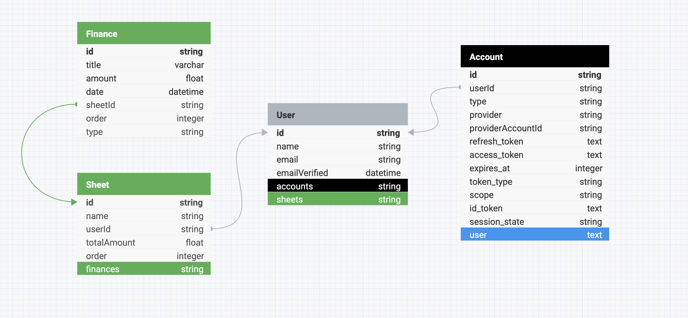

# Financia - Control your Expenses

### Status: Development

Financia is a platform that empowers users to efficiently manage their monthly expenses using customizable sheets. With Financia, users can:

-   Add recurring monthly expenses that will be automatically reflected across all sheets.
-   Record individual expenses in detail.
-   View and manage multiple sheets quickly and simply.

**Highlighted Features:**

-   Centralized Control: Add monthly expenses once and see them automatically distributed across all your sheets.
-   Flexibility: Record individual expenses for a more detailed and accurate view.
-   Intuitive Navigation: Access different sheets quickly and uncomplicatedly.
-   Financial Facilitator: Simplify financial control like never before.

With Financia, you have the power to manage your finances in a smarter and more effective way.

## Database

