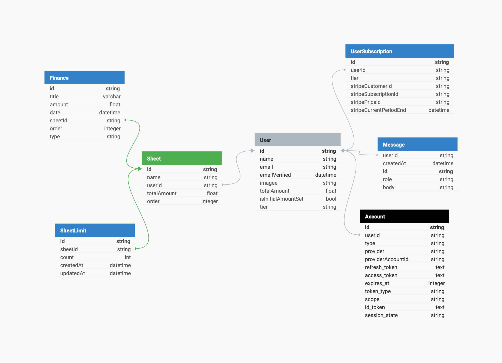

# Finnancia - Control your finances

### Status: Development

Finnancia is a platform that empowers users to efficiently manage their monthly finances using customizable sheets. With Finnancia, users can:

-   Add recurring monthly finances that will be automatically reflected across all sheets.
-   Record individual finances in detail.
-   View and manage multiple sheets quickly and simply.
-   Export sheet data in XLSX format
-   View analysis of their finances

**Highlighted Features:**

-   Centralized Control: Add monthly finances once and see them automatically distributed across all your sheets.
-   Flexibility: Record individual finances for a more detailed and accurate view.
-   Intuitive Navigation: Access different sheets quickly and uncomplicatedly.
-   Finnancial Facilitator: Simplify financial control like never before.

With Finnancia, you have the power to manage your finances in a smarter and more effective way.

## API

### /api/ai

-   **POST => body: { prompt: string }**<br>
    Sends prompt to AI model, returning user message and model response

### /api/finances/[id]

-   **DELETE**
-   **PUT**

### /api/sheets

-   **GET**
-   **POST**

### /api/sheets/[id]

-   **DELETE**
-   **POST**

### /api/sheets/[id]/finance

-   **POST**
-   **GET**

### /user/initialAmount

-   **POST**

## Database



### Soon (in development):

Open: [https://editor.swagger.io](https://editor.swagger.io)

Paste this in the editor:

```
openapi: 3.0.3
info:
  title: Finnancia

  contact:
    email: bozzanienzo@gmail.com
  version: 1.0.0
servers:
  - url: http://localhost:3000
tags:
  - name: sheets
    description: Sheets operations
  - name: finances
    description: Finances operations
  - name: user
    description: User operations
  - name: ai
    description: AI operations
paths:
  /api/sheets:
    get:
      tags:
        - sheets
      summary: Get user sheets data and User.isInitialAmountSet
      description: Gets user sheets (name, id and order) and User.isInitialAmountSet
      operationId: updatePet
      responses:
        '200':
          description: Successful operation
          content:
            application/json:
              schema:
                $ref: '#/components/schemas/GetSheetsAndIsInitialAmountSet'
        '401':
          description: Unauthorized
        '500':
          description: Server error
      security:
        - petstore_auth:
            - write:pets
            - read:pets
    post:
      tags:
        - sheets
      summary: Create a new sheet
      description: Creates new sheet
      requestBody:
        content:
          application/json:
            schema:
              $ref: '#/components/schemas/CreateSheet'
        required: true
      responses:
        '200':
          description: Successful operation
          content:
            application/json:
              schema:
                $ref: '#/components/schemas/SheetCreatedWithSuccess'
        '400':
          description: Invalid input
        '401':
          description: Unauthorized
        '500':
          description: Server error
      security:
        - petstore_auth:
            - write:pets
            - read:pets
  /api/sheets/[id]:
    get:
      tags:
        - sheets
      summary:
      description: Multiple status values can be provided with comma separated strings
      operationId: findPetsByStatus
      parameters:
        - name: status
          in: query
          description: Status values that need to be considered for filter
          required: false
          explode: true
          schema:
            type: string
            default: available
            enum:
              - available
              - pending
              - sold
      responses:
        '200':
          description: successful operation
          content:
            application/json:
              schema:
                type: array
                items:
                  $ref: '#/components/schemas/Pet'
            application/xml:
              schema:
                type: array
                items:
                  $ref: '#/components/schemas/Pet'
        '400':
          description: Invalid status value
      security:
        - petstore_auth:
            - write:pets
            - read:pets
  /pet/findByTags:
    get:
      tags:
        - pet
      summary: Finds Pets by tags
      description: Multiple tags can be provided with comma separated strings. Use tag1, tag2, tag3 for testing.
      operationId: findPetsByTags
      parameters:
        - name: tags
          in: query
          description: Tags to filter by
          required: false
          explode: true
          schema:
            type: array
            items:
              type: string
      responses:
        '200':
          description: successful operation
          content:
            application/json:
              schema:
                type: array
                items:
                  $ref: '#/components/schemas/Pet'
            application/xml:
              schema:
                type: array
                items:
                  $ref: '#/components/schemas/Pet'
        '400':
          description: Invalid tag value
      security:
        - petstore_auth:
            - write:pets
            - read:pets
  /pet/{petId}:
    get:
      tags:
        - pet
      summary: Find pet by ID
      description: Returns a single pet
      operationId: getPetById
      parameters:
        - name: petId
          in: path
          description: ID of pet to return
          required: true
          schema:
            type: integer
            format: int64
      responses:
        '200':
          description: successful operation
          content:
            application/json:
              schema:
                $ref: '#/components/schemas/Pet'
            application/xml:
              schema:
                $ref: '#/components/schemas/Pet'
        '400':
          description: Invalid ID supplied
        '404':
          description: Pet not found
      security:
        - api_key: []
        - petstore_auth:
            - write:pets
            - read:pets
    post:
      tags:
        - pet
      summary: Updates a pet in the store with form data
      description: ''
      operationId: updatePetWithForm
      parameters:
        - name: petId
          in: path
          description: ID of pet that needs to be updated
          required: true
          schema:
            type: integer
            format: int64
        - name: name
          in: query
          description: Name of pet that needs to be updated
          schema:
            type: string
        - name: status
          in: query
          description: Status of pet that needs to be updated
          schema:
            type: string
      responses:
        '400':
          description: Invalid input
      security:
        - petstore_auth:
            - write:pets
            - read:pets
    delete:
      tags:
        - pet
      summary: Deletes a pet
      description: delete a pet
      operationId: deletePet
      parameters:
        - name: api_key
          in: header
          description: ''
          required: false
          schema:
            type: string
        - name: petId
          in: path
          description: Pet id to delete
          required: true
          schema:
            type: integer
            format: int64
      responses:
        '400':
          description: Invalid pet value
      security:
        - petstore_auth:
            - write:pets
            - read:pets
  /pet/{petId}/uploadImage:
    post:
      tags:
        - pet
      summary: uploads an image
      description: ''
      operationId: uploadFile
      parameters:
        - name: petId
          in: path
          description: ID of pet to update
          required: true
          schema:
            type: integer
            format: int64
        - name: additionalMetadata
          in: query
          description: Additional Metadata
          required: false
          schema:
            type: string
      requestBody:
        content:
          application/octet-stream:
            schema:
              type: string
              format: binary
      responses:
        '200':
          description: successful operation
          content:
            application/json:
              schema:
                $ref: '#/components/schemas/ApiResponse'
      security:
        - petstore_auth:
            - write:pets
            - read:pets
  /store/inventory:
    get:
      tags:
        - store
      summary: Returns pet inventories by status
      description: Returns a map of status codes to quantities
      operationId: getInventory
      responses:
        '200':
          description: successful operation
          content:
            application/json:
              schema:
                type: object
                additionalProperties:
                  type: integer
                  format: int32
      security:
        - api_key: []
  /store/order:
    post:
      tags:
        - store
      summary: Place an order for a pet
      description: Place a new order in the store
      operationId: placeOrder
      requestBody:
        content:
          application/json:
            schema:
              $ref: '#/components/schemas/Order'
          application/xml:
            schema:
              $ref: '#/components/schemas/Order'
          application/x-www-form-urlencoded:
            schema:
              $ref: '#/components/schemas/Order'
      responses:
        '200':
          description: successful operation
          content:
            application/json:
              schema:
                $ref: '#/components/schemas/Order'
        '400':
          description: Invalid input
        '422':
          description: Validation exception
  /store/order/{orderId}:
    get:
      tags:
        - store
      summary: Find purchase order by ID
      description: For valid response try integer IDs with value <= 5 or > 10. Other values will generate exceptions.
      operationId: getOrderById
      parameters:
        - name: orderId
          in: path
          description: ID of order that needs to be fetched
          required: true
          schema:
            type: integer
            format: int64
      responses:
        '200':
          description: successful operation
          content:
            application/json:
              schema:
                $ref: '#/components/schemas/Order'
            application/xml:
              schema:
                $ref: '#/components/schemas/Order'
        '400':
          description: Invalid ID supplied
        '404':
          description: Order not found
    delete:
      tags:
        - store
      summary: Delete purchase order by ID
      description: For valid response try integer IDs with value < 1000. Anything above 1000 or nonintegers will generate API errors
      operationId: deleteOrder
      parameters:
        - name: orderId
          in: path
          description: ID of the order that needs to be deleted
          required: true
          schema:
            type: integer
            format: int64
      responses:
        '400':
          description: Invalid ID supplied
        '404':
          description: Order not found
  /user:
    post:
      tags:
        - user
      summary: Create user
      description: This can only be done by the logged in user.
      operationId: createUser
      requestBody:
        description: Created user object
        content:
          application/json:
            schema:
              $ref: '#/components/schemas/User'
          application/xml:
            schema:
              $ref: '#/components/schemas/User'
          application/x-www-form-urlencoded:
            schema:
              $ref: '#/components/schemas/User'
      responses:
        default:
          description: successful operation
          content:
            application/json:
              schema:
                $ref: '#/components/schemas/User'
            application/xml:
              schema:
                $ref: '#/components/schemas/User'
  /user/createWithList:
    post:
      tags:
        - user
      summary: Creates list of users with given input array
      description: Creates list of users with given input array
      operationId: createUsersWithListInput
      requestBody:
        content:
          application/json:
            schema:
              type: array
              items:
                $ref: '#/components/schemas/User'
      responses:
        '200':
          description: Successful operation
          content:
            application/json:
              schema:
                $ref: '#/components/schemas/User'
            application/xml:
              schema:
                $ref: '#/components/schemas/User'
        default:
          description: successful operation
  /user/login:
    get:
      tags:
        - user
      summary: Logs user into the system
      description: ''
      operationId: loginUser
      parameters:
        - name: username
          in: query
          description: The user name for login
          required: false
          schema:
            type: string
        - name: password
          in: query
          description: The password for login in clear text
          required: false
          schema:
            type: string
      responses:
        '200':
          description: successful operation
          headers:
            X-Rate-Limit:
              description: calls per hour allowed by the user
              schema:
                type: integer
                format: int32
            X-Expires-After:
              description: date in UTC when token expires
              schema:
                type: string
                format: date-time
          content:
            application/xml:
              schema:
                type: string
            application/json:
              schema:
                type: string
        '400':
          description: Invalid username/password supplied
  /user/logout:
    get:
      tags:
        - user
      summary: Logs out current logged in user session
      description: ''
      operationId: logoutUser
      parameters: []
      responses:
        default:
          description: successful operation
  /user/{username}:
    get:
      tags:
        - user
      summary: Get user by user name
      description: ''
      operationId: getUserByName
      parameters:
        - name: username
          in: path
          description: 'The name that needs to be fetched. Use user1 for testing. '
          required: true
          schema:
            type: string
      responses:
        '200':
          description: successful operation
          content:
            application/json:
              schema:
                $ref: '#/components/schemas/User'
            application/xml:
              schema:
                $ref: '#/components/schemas/User'
        '400':
          description: Invalid username supplied
        '404':
          description: User not found
    put:
      tags:
        - user
      summary: Update user
      description: This can only be done by the logged in user.
      operationId: updateUser
      parameters:
        - name: username
          in: path
          description: name that need to be deleted
          required: true
          schema:
            type: string
      requestBody:
        description: Update an existent user in the store
        content:
          application/json:
            schema:
              $ref: '#/components/schemas/User'
          application/xml:
            schema:
              $ref: '#/components/schemas/User'
          application/x-www-form-urlencoded:
            schema:
              $ref: '#/components/schemas/User'
      responses:
        default:
          description: successful operation
    delete:
      tags:
        - user
      summary: Delete user
      description: This can only be done by the logged in user.
      operationId: deleteUser
      parameters:
        - name: username
          in: path
          description: The name that needs to be deleted
          required: true
          schema:
            type: string
      responses:
        '400':
          description: Invalid username supplied
        '404':
          description: User not found
components:
  schemas:
    SheetCreatedWithSuccess:
      type: object
      properties:
        success:
          type: string
          example: 'Succesfully created!'
        sheetId:
          type: string
          example: 'xxxxxxxxxxxxxxxx'
    CreateSheet:
      type: object
      properties:
        month:
          type: integer
          format: int64
          example: 7
        year:
          type: integer
          format: int64
          example: 2023
    GetSheetsAndIsInitialAmountSet:
      type: object
      properties:
        sheets:
          type: array
          items:
            $ref: '#/components/schemas/Address'
          example: []
        isInitialAmountSet:
          type: boolean
    Order:
      type: object
      properties:
        id:
          type: integer
          format: int64
          example: 10
        petId:
          type: integer
          format: int64
          example: 198772
        quantity:
          type: integer
          format: int32
          example: 7
        shipDate:
          type: string
          format: date-time
        status:
          type: string
          description: Order Status
          example: approved
          enum:
            - placed
            - approved
            - delivered
        complete:
          type: boolean
      xml:
        name: order
    Customer:
      type: object
      properties:
        id:
          type: integer
          format: int64
          example: 100000
        username:
          type: string
          example: fehguy
        address:
          type: array
          xml:
            name: addresses
            wrapped: true
          items:
            $ref: '#/components/schemas/Address'
      xml:
        name: customer
    Address:
      type: object
      properties:
        street:
          type: string
          example: 437 Lytton
        city:
          type: string
          example: Palo Alto
        state:
          type: string
          example: CA
        zip:
          type: string
          example: '94301'
      xml:
        name: address
    Category:
      type: object
      properties:
        id:
          type: integer
          format: int64
          example: 1
        name:
          type: string
          example: Dogs
      xml:
        name: category
    User:
      type: object
      properties:
        id:
          type: integer
          format: int64
          example: 10
        username:
          type: string
          example: theUser
        firstName:
          type: string
          example: John
        lastName:
          type: string
          example: James
        email:
          type: string
          example: john@email.com
        password:
          type: string
          example: '12345'
        phone:
          type: string
          example: '12345'
        userStatus:
          type: integer
          description: User Status
          format: int32
          example: 1
      xml:
        name: user
    Tag:
      type: object
      properties:
        id:
          type: integer
          format: int64
        name:
          type: string
      xml:
        name: tag
    Pet:
      required:
        - name
        - photoUrls
      type: object
      properties:
        id:
          type: integer
          format: int64
          example: 10
        name:
          type: string
          example: doggie
        category:
          $ref: '#/components/schemas/Category'
        photoUrls:
          type: array
          xml:
            wrapped: true
          items:
            type: string
            xml:
              name: photoUrl
        tags:
          type: array
          xml:
            wrapped: true
          items:
            $ref: '#/components/schemas/Tag'
        status:
          type: string
          description: pet status in the store
          enum:
            - available
            - pending
            - sold
      xml:
        name: pet
    ApiResponse:
      type: object
      properties:
        code:
          type: integer
          format: int32
        type:
          type: string
        message:
          type: string
      xml:
        name: '##default'
  requestBodies:
    Pet:
      description: Pet object that needs to be added to the store
      content:
        application/json:
          schema:
            $ref: '#/components/schemas/Pet'
        application/xml:
          schema:
            $ref: '#/components/schemas/Pet'
    UserArray:
      description: List of user object
      content:
        application/json:
          schema:
            type: array
            items:
              $ref: '#/components/schemas/User'
  securitySchemes:
    petstore_auth:
      type: oauth2
      flows:
        implicit:
          authorizationUrl: https://petstore3.swagger.io/oauth/authorize
          scopes:
            write:pets: modify pets in your account
            read:pets: read your pets
    api_key:
      type: apiKey
      name: api_key
      in: header
```
